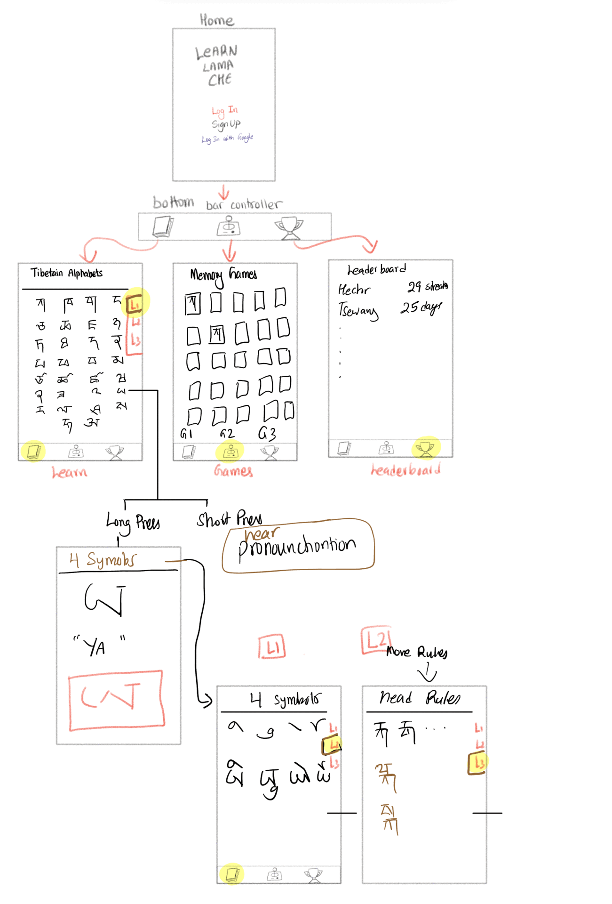
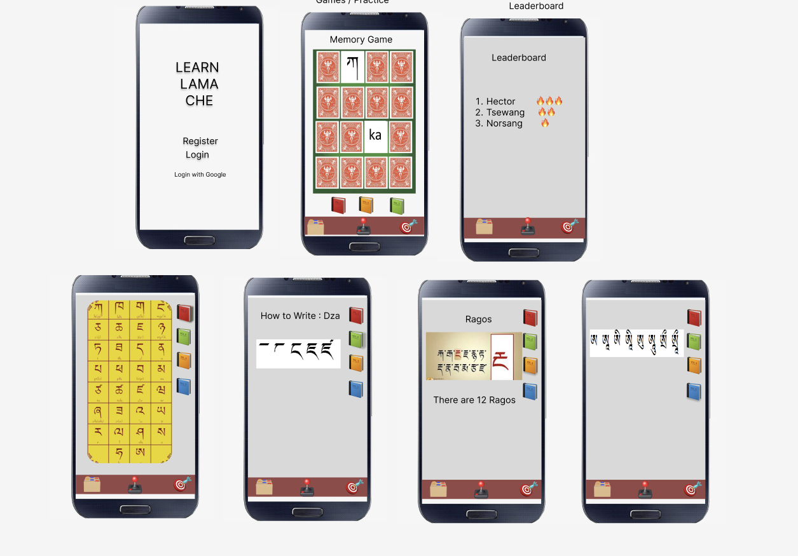

# Milestone 1 - Learn Lama Che (Unit 7)

## Table of Contents

1. [Overview](#Overview)
2. [Product Spec](#Product-Spec)
3. [Wireframes](#Wireframes)

## Overview

### Description

"Learn Lama Che" is an educational app designed to help beginners learn the basics of the Tibetan alphabet. It uses interactive lessons, flashcards, and memory games to teach pronunciation, recognition, and writing of Tibetan characters. With engaging daily reminders, gamified progress tracking, and audio support, this app is ideal for users looking to learn Tibetan effectively while improving memory skills.

### App Evaluation

- **Category:** Education
- **Mobile:** Features audio pronunciation, real-time progress tracking, and push notifications, making it uniquely suited for mobile use.
- **Story:** Offers a compelling value to users learning Tibetan, especially for those in niche communities like the Hyolmo Society of America. Promotes cultural education and memory improvement.
- **Market:** Targets a niche market of Tibetan language learners, including diaspora communities and language enthusiasts, with minimal competition in this space.
- **Habit:** Encourages daily engagement through progress tracking, streaks, and gamified elements.
- **Scope:** Clear MVP with essential lessons, progress tracking, and audio support. Additional features like interactive games can be added later for scalability.

## Product Spec

### 1. User Features (Required and Optional)

**Required Features**

1. Learn Tibetan alphabet using flashcards.
2. Audio playback for correct pronunciation of each character.
3. Gamified progress tracking with streaks and rewards.
4. Push notifications for daily practice reminders.
5. Progress saved locally and synced across devices.

**Optional Features**

1. Interactive writing practice with stroke-order guidance.
2. Social feature for competing with friends.
3. Offline mode for lessons and practice.
4. Customizable study plans.
5. Voice recognition to check pronunciation accuracy.

### 2. Screen Archetypes

- **Onboarding Screen**

  - Introduction to the app and its features.
  - User chooses learning goals (e.g., writing, pronunciation, both).

- **Home Screen**

  - Overview of daily progress and streaks.
  - Quick access to lessons and flashcards.

- **Lesson Screen**

  - Displays Tibetan characters with audio playback for pronunciation.
  - Allows users to swipe through flashcards.

- **Game Screen**

  - Memory games and quizzes to test knowledge.
  - Timed challenges for gamified learning.

- **Progress Screen**
  - Displays user stats, streaks, and rewards earned.
  - Visual progress tracker for lessons completed.

### 3. Navigation

**Tab Navigation** (Tab to Screen)

- Home
- Lessons
- Games
- Progress

**Flow Navigation** (Screen to Screen)

- **Onboarding Screen**
  - → Home Screen
- **Home Screen**
  - → Lesson Screen
  - → Game Screen
  - → Progress Screen
- **Lesson Screen**
  - → Next/Previous Lesson
  - → Home Screen
- **Game Screen**
  - → Game Results
  - → Home Screen
- **Progress Screen**
  - → Detailed Progress Breakdown
  - → Home Screen

## Wireframes

### Low-Fidelity Wireframes

---

### [BONUS] Digital Wireframes & Mockups

### [BONUS] Interactive Prototype

## 

# Next Steps:

- Design digital wireframes for core screens.
- Build out the MVP features: flashcards, audio playback, progress tracking, and daily reminders.
- Set up the GitHub repository and upload brainstorming.md and this milestone document.

---
